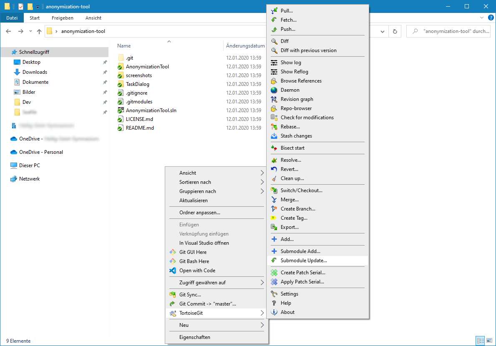

# Projekt bauen

Wer das Projekt bauen (und evtl. auch daran mitarbeiten) möchte, benötigt folgende Tools:

* Visual Studio 2019 (Community-Edition reicht aus)
* .NET Core 3 (lässt sich über den Visual Studio Installer ggf. nachinstallieren)
* Git (TortoiseGit bspw.)
* [dotnet-project-licenses](https://www.nuget.org/packages/dotnet-project-licenses): `dotnet tool install --global dotnet-project-licenses --version 1.1.1` 

## Klonen

Da das Projekt jedoch die [TaskDialog-Bibliothek von ](https://github.com/kpreisser/TaskDialog) verwendet, muss auch diese mittels Git heruntergeladen werden (Stichwort: git submodules). Wer TortoiseGit für Windows nutzt, macht einen Rechtsklick im Ordner und klickt auf "ToirtoiseGit" -> "Submodules Update":

Anschließend mit "OK" bestätigen:

Dann wird die benötigte Bibliothek heruntergeladen.

Erst jetzt ist das Öffnen des Projektes mittels Visual Studio möglich.
