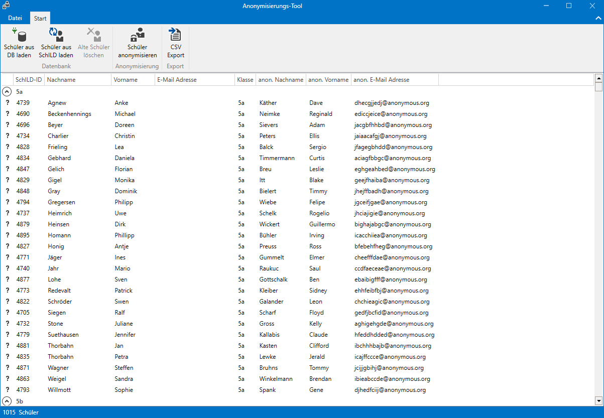
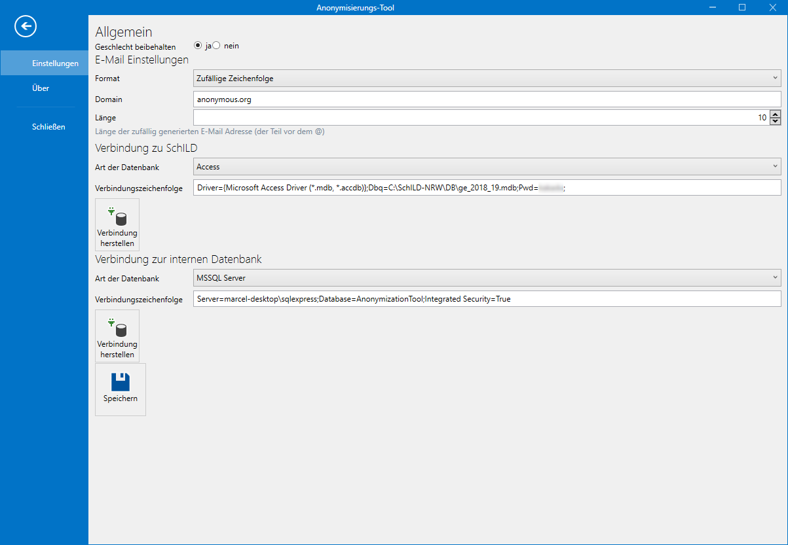

# Anomymisierungs-Tool

Mithilfe dieses Tools lassen sich Schülerinnen und Schüler aus SchILD-NRW importieren und anschließend anonymisieren. Hierber wird ein anonymer Vor- und Nachname sowie eine anonyme E-Mail Adresse erzeugt. 





## Voraussetzungen

Aktuell funktioniert das Tool nur, wenn SchILD mit einer Access-Datenbank betrieben wird. Perspektisch soll jedoch auch Microsoft SQL und MySQL unterstützt werden.

Damit das Tool mit Access kommunizieren kann, wird das Access Database Engine Redistributable in der entsprechenden Version benötigt.

* [Download für Office 2010](https://www.microsoft.com/de-DE/download/details.aspx?id=13255) (nicht getestet)
* [Download für Office 2013](https://www.microsoft.com/en-us/download/details.aspx?id=39358) (nicht getestet)
* [Download für Office 2016/2019/Office 365](https://www.microsoft.com/en-us/download/details.aspx?id=54920)

## Installation

Einfach den [aktuellen Installer](https://github.com/SchulIT/anonymization-tool/releases) herunterladen und starten. Falls das Programm bereits installiert ist, wird es automatisch aktualisiert.

Das Programm ist in .NET Core 3 geschrieben und bringt die entsprechende Runtime direkt mit, sodass diese nicht separat installiert werden muss.

## Einrichtung

### Verbindung zu SchILD herstellen

Die Verbindungszeichenfolge für die Verbindung zur SchILD-Datenbank lautet folgendermaßen:

```
Driver={Microsoft Access Driver (*.mdb, *.accdb)};Dbq=$path$;Pwd=******;
```

❗ Dabei muss `$path$` durch den Pfad zur Datenbankdatei (bspw. `C:\SchILD-NRW\DB\ge_2018_19.mdb`) angepasst werden.

Das Standard-Passwort für die Access-Datenbank von SchILD muss beim Hersteller angefragt werden.

### Verbindung für die interne Datenbank

Um die anonymen Identitäten abzuspeichern, wird eine interne Datenbank verwendet. Am einfachsten ist es, eine SQLite-Datenbank zu nutzen. Wer einen SQL-Server betreibt, kann jedoch auch einen Microsoft SQL Server oder MySQL/MariaDB-Server verwenden.

Grundsätzlich wird das [Entity Framework Core](https://docs.microsoft.com/de-de/ef/core/) für die interne Datenbank verwendet. 

#### SQLite

```
Filename=$path$
```

Bei $path$ den Dateinamen der SQLite-Datenbank angeben. Die Datei wird automatisch beim ersten Verbinden erstellt.

#### Microsoft SQL

```
Server=server\sqlexpress;Database=AnonymizationTool;Integrated Security=True
```

* `Server`: Hier wird der Pfad zur SQL-Server-Instanz (i.d.R. ist `server` der Computername, `sqlexpress` ist der Instanzname bei SQL Server Express)
* `Database`: Hier den gewünschten Datenbanknamen eintragen. Die Datenbank wird automatisch erstellt.
* `Integrated Security=True`: So wird der aktuelle Benutzername zur Verbindung. Alternativ lassen sich mit `User=$username%; Password=$password$ auch Benutzername und Passwort separat festlegen.

#### MySQL

```
Server=localhost;Database=anonymization_tool;User=anonmyzation_tool_user;Password=your_secret_password;
```

* `Server`: Servername des MySQL Servers
* `Database`: Name der Datenbank auf dem MySQL Server. Die Datenbank wird automatisch angelegt, falls sie nicht vorhanden sein sollte.
* `User`: Benutzername zum Verbinden
* `Password`: Das Password des Benutzers, der sich verbinden möchte.

## Verwendung

Der Workflow sieht folgendermaßen aus:

1. Benutzer aus der internen Datenbank laden
2. Benutzer aus SchILD laden
3. Anonyme Identitäten generieren

Nach Schritt 2 ist es auch möglich, Schülerinnen und Schüler, die nicht mehr in SchILD gepflegt werden, aus der internen Datenbank zu löschen. Diese Benutzer werden mit einem roten "x" markiert. 

**Wichtig:** Beim Löschen werden diese Benutzer jedoch nicht entgültig gelöscht, sondern nur als gelöscht markiert. Ein Wiederherstellen auf Datenbankebene ist somit möglich.

## Export

Anonyme Identitäten können als CSV-Datei exportiert werden, um sie dann weiterzuverarbeiten. 

## Lizenz

[MIT License](LICENSE.md)

## Mitmachen

Wer möchte, darf gerne Bugs melden oder Pull Requests einreichen :smile: